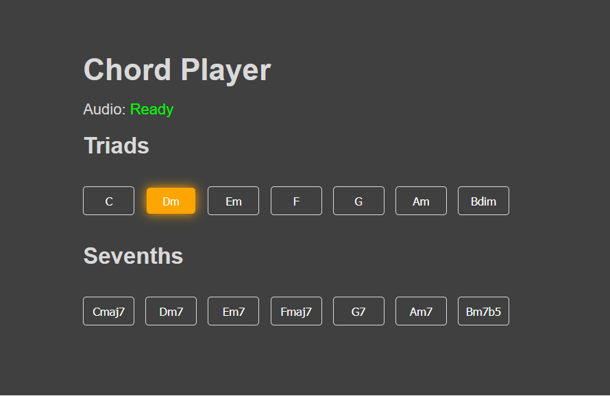

# Chord Player

## Description

Play chords by clicking on buttons, you can access it [here](https://correa-coder.github.io/chord-player/). This project uses the [Tone.js](https://github.com/Tonejs/Tone.js/) library to generate the sounds.

> Note: Currently only chords from the key of C major are available.